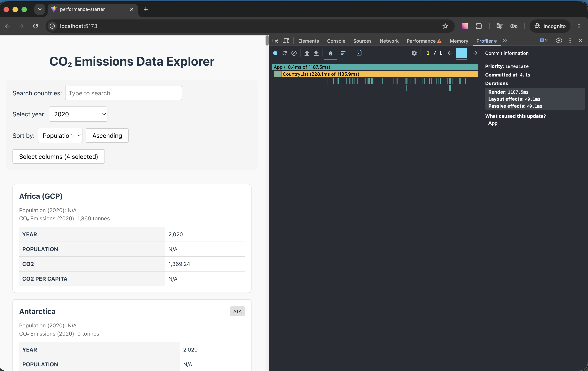
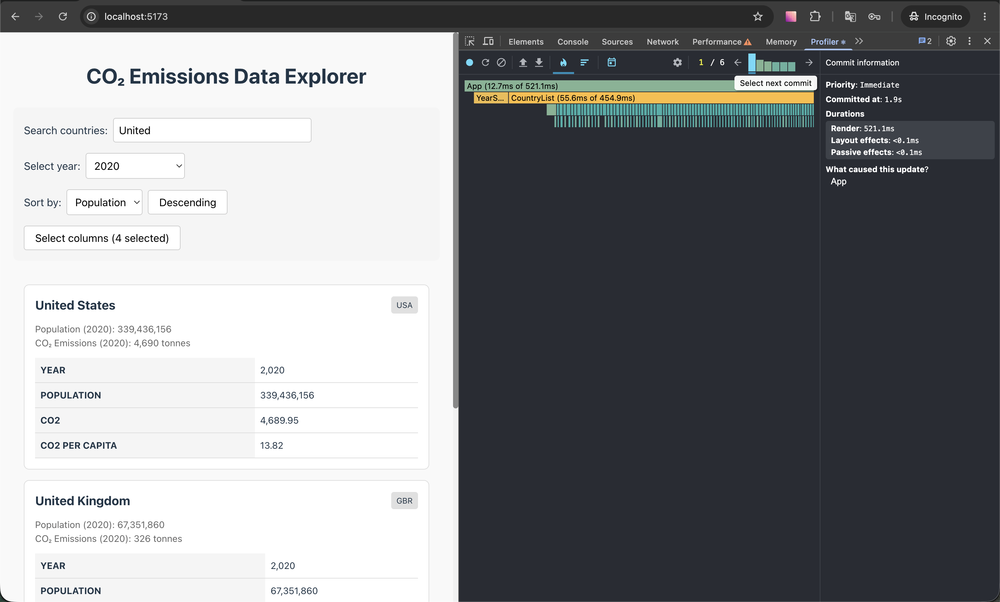
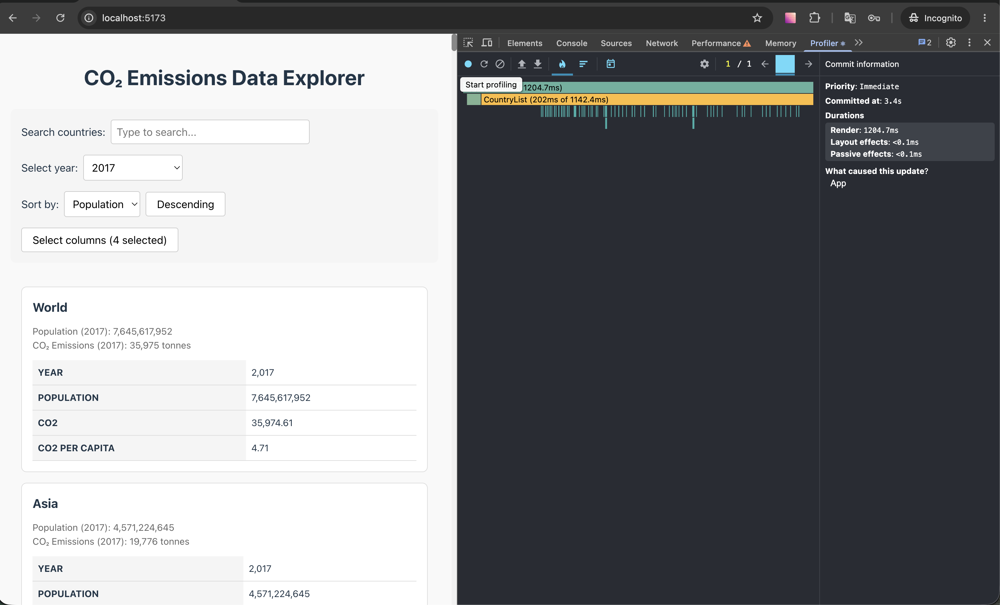
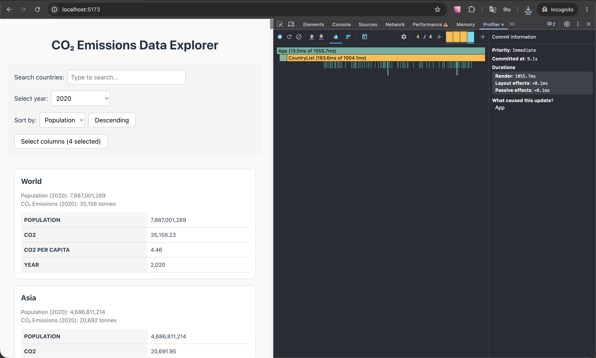

# Performance Optimization Report

CO₂ Emissions Data Explorer — profiling baseline, optimizations, and before/after comparison.

---

## Profiling Methodology (test conditions)

All measurements were captured under identical conditions for baseline and optimized runs so the
before/after comparison is valid:

- **Mode:** development (`npm run dev`, Vite) — per task requirement.
- **Browser:** Chrome Incognito, **React DevTools the only enabled extension**.
- **CPU throttle:** Chrome DevTools → Performance → **CPU 6× slowdown**, identical in both phases.
- **react-scan:** `enabled: false` while recording Profiler numbers (used separately, only as a
  qualitative "what re-renders and why" pass).
- **StrictMode:** left enabled (dev double-render) and identical across both phases.

---

## Baseline Measurements

### Interaction A: Sort countries

- **Commit duration**: 4100 ms
- **Render duration**: 1187 ms
- **# commits**: 1
- **Screenshot**: /

### Interaction B: Search countries (type "United")

- **Commit duration**: 1900 ms
- **Render duration**: 521 ms
- **# commits**: 6
- **Screenshot**: 

### Interaction C: Change year

- **Commit duration**: 3400 ms
- **Render duration**: 1204 ms
- **# commits**: 1
- **Screenshot**: 

### Interaction D: Toggle column

- **Commit duration**: 9100 ms
- **Render duration**: 1055 ms
- **# commits**: 4
- **Screenshot**: 

---

## Bottlenecks Identified

Confirm each of these against your flame charts before writing the fix.

| # | Location | Problem | Fix (Phase 2) |
| - | -------- | ------- | ------------- |
| 1 | `app.tsx` single `state` object + handlers recreated each render | Every interaction re-renders all 254 cards | `useCallback` handlers, `React.memo` children |
| 2 | `country-list.tsx` filter+sort runs every render | `createYearDataMap()` called inside sort comparator → O(n log n) map builds | `useMemo` for filtered/sorted list, precompute maps |
| 3 | `country-card.tsx` rebuilds `createYearDataMap()` every render | Heavy per-card work × 254 | `React.memo` + memoize map |
| 4 | `country-list.tsx:47`, `data-table.tsx:25` `key={index}` | Index keys defeat reconciliation | stable keys (`country.id`, column name) |
| 5 | `app.tsx` `getAvailableYears(data)` every render | Iterates 50,411 rows each render | `useMemo` on `data` |
| 6 | 254 cards rendered to DOM at once | Thousands of nodes | **Virtualization** (react-window) |

---

## Optimizations Applied

- [x] `useMemo` for computed values (filtered/sorted list, available years)
- [x] `useCallback` for event handlers
- [x] `React.memo` on `CountryCard`, `DataTable`, controls
- [ ] Proper `key` props for all lists/tables
- [ ] Virtualization for the country list

_Notes / commits: fill in_

---

## Optimized Measurements

### Interaction A: Sort countries

- **Commit duration**: \_\_\_ ms
- **Render duration**: \_\_\_ ms
- **# commits**: \_\_\_
- **Screenshot**: 

### Interaction B: Search countries (type "United")

- **Commit duration**: \_\_\_ ms
- **Render duration**: \_\_\_ ms
- **# commits**: \_\_\_
- **Screenshot**: 

### Interaction C: Change year

- **Commit duration**: \_\_\_ ms
- **Render duration**: \_\_\_ ms
- **# commits**: \_\_\_
- **Screenshot**: 

### Interaction D: Toggle column

- **Commit duration**: \_\_\_ ms
- **Render duration**: \_\_\_ ms
- **# commits**: \_\_\_
- **Screenshot**: 

---

## Summary of Improvements

| Interaction      | Baseline (ms) | Optimized (ms) | Improvement |
| ---------------- | ------------- | -------------- | ----------- |
| Sort countries   | \_\_\_        | \_\_\_         | \_\_\_%     |
| Search countries | \_\_\_        | \_\_\_         | \_\_\_%     |
| Change year      | \_\_\_        | \_\_\_         | \_\_\_%     |
| Toggle column    | \_\_\_        | \_\_\_         | \_\_\_%     |
| **Average**      | **\_\_\_**    | **\_\_\_**     | **\_\_\_%** |

> Improvement % = (baseline − optimized) / baseline × 100.
